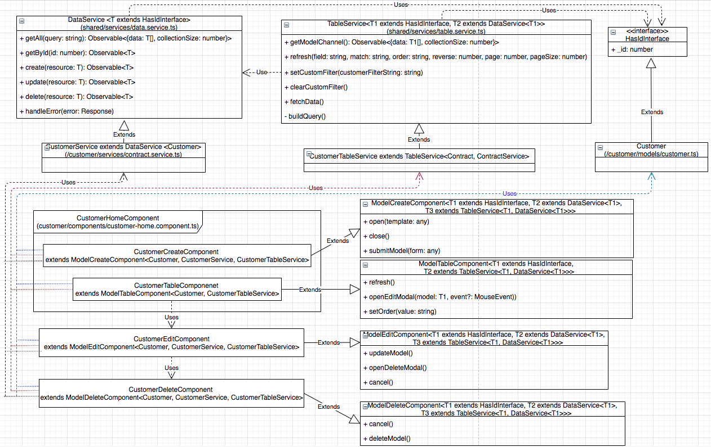

## Table of Content
[1. Main Features](#Main)  
[2. Components & Services Inheritance Structure](#Components)  
[3. Project Structure](#Project)  

<a name="Main"/>

## Project Demo

<a name="Components"/>

## Components & Services Inheritance Structure
I developed the inheritance structure when I refactored the system to improve the extensibility and reusability. The base classes with generic types are used to capture common functionalities to reduce redundant code. In the figure below, I have <b>Customer</b> CRUD screen as an example. However, this also applies to other models such as <b>Contract</b>. 

* <b>DataService</b> and <b>TableService</b> are base classes for the services of the model.
* All model classes need to extend <b>HasIdInterface</b>.
* <b>XXXHomeComponent</b> contains <b>XXXCreateComponent</b>, <b>XXXTableComponent</b>, <b>XXXEditComponent</b>, and <b>XXXCustomerDeleteComponent</b>. Each of which has the corresponding base class to extend. <b>XXX</b> refers to the model name, e.g. Customer, Contract, etc.

<a name="Project"/>

## Project Structure
The project consists four main modules <b>app/admin</b>, <b>app/auth</b>, <b>app/client</b>, and <b>app/shared</b>.
<ul>
  <li><b>app/admin</b> contains code to implement the CRUD screen for customers/parking-lots/contracts, dashboard, settings, and report generation </li>
  <li><b>app/auth</b> contains code to implement the features for user registration/login, change/forget/reset Paassword</li>
  <li><b>app/client</b> has no content becasue the system currently does not support access to the customer</li>
  <li><b>app/shared</b> contains shared components/models/directives/pipes/services/utility classes</li>
</ul>

Free feel to explore the content of the directory by clicking the hyperlinks.

<a href="https://github.com/ianyehwork/Contract-Management-Client-Angular/tree/master/src">src</a> 
	├── <a href="https://github.com/ianyehwork/Contract-Management-Client-Angular/tree/master/src/app/">app</a> 
	│   ├── <a href="https://github.com/ianyehwork/Contract-Management-Client-Angular/tree/master/src/app/admin/">admin</a> 
	│   │   ├── <a href="https://github.com/ianyehwork/Contract-Management-Client-Angular/tree/master/src/app/admin/contract/">contract</a> 
	│   │   │   ├── <a href="https://github.com/ianyehwork/Contract-Management-Client-Angular/tree/master/src/app/admin/contract/components/">components</a> 
	│   │   │   │   ├── <a href="https://github.com/ianyehwork/Contract-Management-Client-Angular/tree/master/src/app/admin/contract/components/contract-create/">contract-create</a> 
	│   │   │   │   ├── <a href="https://github.com/ianyehwork/Contract-Management-Client-Angular/tree/master/src/app/admin/contract/components/contract-delete/">contract-delete</a> 
	│   │   │   │   ├── <a href="https://github.com/ianyehwork/Contract-Management-Client-Angular/tree/master/src/app/admin/contract/components/contract-edit/">contract-edit</a> 
	│   │   │   │   ├── <a href="https://github.com/ianyehwork/Contract-Management-Client-Angular/tree/master/src/app/admin/contract/components/contract-home/">contract-home</a> 
	│   │   │   │   ├── <a href="https://github.com/ianyehwork/Contract-Management-Client-Angular/tree/master/src/app/admin/contract/components/contract-table/">contract-table</a> 
	│   │   │   │   ├── <a href="https://github.com/ianyehwork/Contract-Management-Client-Angular/tree/master/src/app/admin/contract/components/payment-create/">payment-create</a> 
	│   │   │   │   ├── <a href="https://github.com/ianyehwork/Contract-Management-Client-Angular/tree/master/src/app/admin/contract/components/payment-edit/">payment-edit</a> 
	│   │   │   │   └── <a href="https://github.com/ianyehwork/Contract-Management-Client-Angular/tree/master/src/app/admin/contract/components/payment-table/">payment-table</a> 
	│   │   │   ├── <a href="https://github.com/ianyehwork/Contract-Management-Client-Angular/tree/master/src/app/admin/contract/models/">models</a> 
	│   │   │   └── <a href="https://github.com/ianyehwork/Contract-Management-Client-Angular/tree/master/src/app/admin/contract/services/">services</a> 
	│   │   ├── <a href="https://github.com/ianyehwork/Contract-Management-Client-Angular/tree/master/src/app/admin/customer/">customer</a> 
	│   │   │   ├── <a href="https://github.com/ianyehwork/Contract-Management-Client-Angular/tree/master/src/app/admin/customer/components/">components</a> 
	│   │   │   │   ├── <a href="https://github.com/ianyehwork/Contract-Management-Client-Angular/tree/master/src/app/admin/customer/components/customer-create/">customer-create</a> 
	│   │   │   │   ├── <a href="https://github.com/ianyehwork/Contract-Management-Client-Angular/tree/master/src/app/admin/customer/components/customer-delete/">customer-delete</a> 
	│   │   │   │   ├── <a href="https://github.com/ianyehwork/Contract-Management-Client-Angular/tree/master/src/app/admin/customer/components/customer-edit/">customer-edit</a> 
	│   │   │   │   ├── <a href="https://github.com/ianyehwork/Contract-Management-Client-Angular/tree/master/src/app/admin/customer/components/customer-home/">customer-home</a> 
	│   │   │   │   ├── <a href="https://github.com/ianyehwork/Contract-Management-Client-Angular/tree/master/src/app/admin/customer/components/customer-search/">customer-search</a> 
	│   │   │   │   └── <a href="https://github.com/ianyehwork/Contract-Management-Client-Angular/tree/master/src/app/admin/customer/components/customer-table/">customer-table</a> 
	│   │   │   ├── <a href="https://github.com/ianyehwork/Contract-Management-Client-Angular/tree/master/src/app/admin/customer/models/">models</a> 
	│   │   │   └── <a href="https://github.com/ianyehwork/Contract-Management-Client-Angular/tree/master/src/app/admin/customer/services/">services</a> 
	│   │   ├── <a href="https://github.com/ianyehwork/Contract-Management-Client-Angular/tree/master/src/app/admin/dashboard/">dashboard</a> 
	│   │   │   ├── <a href="https://github.com/ianyehwork/Contract-Management-Client-Angular/tree/master/src/app/admin/dashboard/components/">components</a> 
	│   │   │   │   ├── <a href="https://github.com/ianyehwork/Contract-Management-Client-Angular/tree/master/src/app/admin/dashboard/components/active-parking-lot-table/">active-parking-lot-table</a> 
	│   │   │   │   ├── <a href="https://github.com/ianyehwork/Contract-Management-Client-Angular/tree/master/src/app/admin/dashboard/components/active-payment-table/">active-payment-table</a> 
	│   │   │   │   ├── <a href="https://github.com/ianyehwork/Contract-Management-Client-Angular/tree/master/src/app/admin/dashboard/components/dashboard-home/">dashboard-home</a> 
	│   │   │   │   ├── <a href="https://github.com/ianyehwork/Contract-Management-Client-Angular/tree/master/src/app/admin/dashboard/components/income-graph/">income-graph</a> 
	│   │   │   │   └── <a href="https://github.com/ianyehwork/Contract-Management-Client-Angular/tree/master/src/app/admin/dashboard/components/payment-calendar/">payment-calendar</a> 
	│   │   │   └── <a href="https://github.com/ianyehwork/Contract-Management-Client-Angular/tree/master/src/app/admin/dashboard/services/">services</a> 
	│   │   ├── <a href="https://github.com/ianyehwork/Contract-Management-Client-Angular/tree/master/src/app/admin/home/">home</a> 
	│   │   ├── <a href="https://github.com/ianyehwork/Contract-Management-Client-Angular/tree/master/src/app/admin/income/">income</a> 
	│   │   │   └── <a href="https://github.com/ianyehwork/Contract-Management-Client-Angular/tree/master/src/app/admin/income/components/">components</a> 
	│   │   │   &nbsp;&nbsp;&nbsp; ├── <a href="https://github.com/ianyehwork/Contract-Management-Client-Angular/tree/master/src/app/admin/income/components/income-home/">income-home</a> 
	│   │   │   &nbsp;&nbsp;&nbsp; └── <a href="https://github.com/ianyehwork/Contract-Management-Client-Angular/tree/master/src/app/admin/income/components/income-table/">income-table</a> 
	│   │   ├── <a href="https://github.com/ianyehwork/Contract-Management-Client-Angular/tree/master/src/app/admin/navbar/">navbar</a> 
	│   │   ├── <a href="https://github.com/ianyehwork/Contract-Management-Client-Angular/tree/master/src/app/admin/parking/">parking</a> 
	│   │   │   ├── <a href="https://github.com/ianyehwork/Contract-Management-Client-Angular/tree/master/src/app/admin/parking/components/">components</a> 
	│   │   │   │   ├── <a href="https://github.com/ianyehwork/Contract-Management-Client-Angular/tree/master/src/app/admin/parking/components/parking-area-create/">parking-area-create</a> 
	│   │   │   │   ├── <a href="https://github.com/ianyehwork/Contract-Management-Client-Angular/tree/master/src/app/admin/parking/components/parking-area-delete/">parking-area-delete</a> 
	│   │   │   │   ├── <a href="https://github.com/ianyehwork/Contract-Management-Client-Angular/tree/master/src/app/admin/parking/components/parking-area-edit/">parking-area-edit</a> 
	│   │   │   │   ├── <a href="https://github.com/ianyehwork/Contract-Management-Client-Angular/tree/master/src/app/admin/parking/components/parking-home/">parking-home</a> 
	│   │   │   │   ├── <a href="https://github.com/ianyehwork/Contract-Management-Client-Angular/tree/master/src/app/admin/parking/components/parking-lot-create/">parking-lot-create</a> 
	│   │   │   │   ├── <a href="https://github.com/ianyehwork/Contract-Management-Client-Angular/tree/master/src/app/admin/parking/components/parking-lot-delete/">parking-lot-delete</a> 
	│   │   │   │   ├── <a href="https://github.com/ianyehwork/Contract-Management-Client-Angular/tree/master/src/app/admin/parking/components/parking-lot-edit/">parking-lot-edit</a> 
	│   │   │   │   ├── <a href="https://github.com/ianyehwork/Contract-Management-Client-Angular/tree/master/src/app/admin/parking/components/parking-lot-search/">parking-lot-search</a> 
	│   │   │   │   ├── <a href="https://github.com/ianyehwork/Contract-Management-Client-Angular/tree/master/src/app/admin/parking/components/parking-lot-table/">parking-lot-table</a> 
	│   │   │   │   └── <a href="https://github.com/ianyehwork/Contract-Management-Client-Angular/tree/master/src/app/admin/parking/components/parking-table/">parking-table</a> 
	│   │   │   ├── <a href="https://github.com/ianyehwork/Contract-Management-Client-Angular/tree/master/src/app/admin/parking/models/">models</a> 
	│   │   │   └── <a href="https://github.com/ianyehwork/Contract-Management-Client-Angular/tree/master/src/app/admin/parking/services/">services</a> 
	│   │   ├── <a href="https://github.com/ianyehwork/Contract-Management-Client-Angular/tree/master/src/app/admin/report/">report</a> 
	│   │   │   ├── <a href="https://github.com/ianyehwork/Contract-Management-Client-Angular/tree/master/src/app/admin/report/components/">components</a> 
	│   │   │   │   └── <a href="https://github.com/ianyehwork/Contract-Management-Client-Angular/tree/master/src/app/admin/report/components/report-home/">report-home</a> 
	│   │   │   └── <a href="https://github.com/ianyehwork/Contract-Management-Client-Angular/tree/master/src/app/admin/report/services/">services</a> 
	│   │   └── <a href="https://github.com/ianyehwork/Contract-Management-Client-Angular/tree/master/src/app/admin/setting/">setting</a> 
	│   │   &nbsp;&nbsp;&nbsp; └── <a href="https://github.com/ianyehwork/Contract-Management-Client-Angular/tree/master/src/app/admin/setting/components/">components</a> 
	│   │   &nbsp;&nbsp;&nbsp; &nbsp;&nbsp;&nbsp; ├── <a href="https://github.com/ianyehwork/Contract-Management-Client-Angular/tree/master/src/app/admin/setting/components/setting-change-password/">setting-change-password</a> 
	│   │   &nbsp;&nbsp;&nbsp; &nbsp;&nbsp;&nbsp; ├── <a href="https://github.com/ianyehwork/Contract-Management-Client-Angular/tree/master/src/app/admin/setting/components/setting-customer-token/">setting-customer-token</a> 
	│   │   &nbsp;&nbsp;&nbsp; &nbsp;&nbsp;&nbsp; ├── <a href="https://github.com/ianyehwork/Contract-Management-Client-Angular/tree/master/src/app/admin/setting/components/setting-home/">setting-home</a> 
	│   │   &nbsp;&nbsp;&nbsp; &nbsp;&nbsp;&nbsp; └── <a href="https://github.com/ianyehwork/Contract-Management-Client-Angular/tree/master/src/app/admin/setting/components/setting-tabset/">setting-tabset</a> 
	│   ├── <a href="https://github.com/ianyehwork/Contract-Management-Client-Angular/tree/master/src/app/auth/">auth</a> 
	│   │   ├── <a href="https://github.com/ianyehwork/Contract-Management-Client-Angular/tree/master/src/app/auth/components/">components</a> 
	│   │   │   ├── <a href="https://github.com/ianyehwork/Contract-Management-Client-Angular/tree/master/src/app/auth/components/auth-home/">auth-home</a> 
	│   │   │   ├── <a href="https://github.com/ianyehwork/Contract-Management-Client-Angular/tree/master/src/app/auth/components/login/">login</a> 
	│   │   │   ├── <a href="https://github.com/ianyehwork/Contract-Management-Client-Angular/tree/master/src/app/auth/components/no-access/">no-access</a> 
	│   │   │   ├── <a href="https://github.com/ianyehwork/Contract-Management-Client-Angular/tree/master/src/app/auth/components/password-change/">password-change</a> 
	│   │   │   ├── <a href="https://github.com/ianyehwork/Contract-Management-Client-Angular/tree/master/src/app/auth/components/password-reset/">password-reset</a> 
	│   │   │   └── <a href="https://github.com/ianyehwork/Contract-Management-Client-Angular/tree/master/src/app/auth/components/register/">register</a> 
	│   │   ├── <a href="https://github.com/ianyehwork/Contract-Management-Client-Angular/tree/master/src/app/auth/models/">models</a> 
	│   │   └── <a href="https://github.com/ianyehwork/Contract-Management-Client-Angular/tree/master/src/app/auth/services/">services</a> 
	│   ├── <a href="https://github.com/ianyehwork/Contract-Management-Client-Angular/tree/master/src/app/client/">client</a> 
	│   └── <a href="https://github.com/ianyehwork/Contract-Management-Client-Angular/tree/master/src/app/shared/">shared</a> 
	│   &nbsp;&nbsp;&nbsp; ├── <a href="https://github.com/ianyehwork/Contract-Management-Client-Angular/tree/master/src/app/shared/components/">components</a> 
	│   &nbsp;&nbsp;&nbsp; │   ├── <a href="https://github.com/ianyehwork/Contract-Management-Client-Angular/tree/master/src/app/shared/components/error-handler/">error-handler</a> 
	│   &nbsp;&nbsp;&nbsp; │   ├── <a href="https://github.com/ianyehwork/Contract-Management-Client-Angular/tree/master/src/app/shared/components/page-loading/">page-loading</a> 
	│   &nbsp;&nbsp;&nbsp; │   ├── <a href="https://github.com/ianyehwork/Contract-Management-Client-Angular/tree/master/src/app/shared/components/timepicker/">timepicker</a> 
	│   &nbsp;&nbsp;&nbsp; │   └── <a href="https://github.com/ianyehwork/Contract-Management-Client-Angular/tree/master/src/app/shared/components/toast-messages/">toast-messages</a> 
	│   &nbsp;&nbsp;&nbsp; ├── <a href="https://github.com/ianyehwork/Contract-Management-Client-Angular/tree/master/src/app/shared/directives/">directives</a> 
	│   &nbsp;&nbsp;&nbsp; ├── <a href="https://github.com/ianyehwork/Contract-Management-Client-Angular/tree/master/src/app/shared/models/">models</a> 
	│   &nbsp;&nbsp;&nbsp; ├── <a href="https://github.com/ianyehwork/Contract-Management-Client-Angular/tree/master/src/app/shared/pipe/">pipe</a> 
	│   &nbsp;&nbsp;&nbsp; ├── <a href="https://github.com/ianyehwork/Contract-Management-Client-Angular/tree/master/src/app/shared/services/">services</a> 
	│   &nbsp;&nbsp;&nbsp; └── <a href="https://github.com/ianyehwork/Contract-Management-Client-Angular/tree/master/src/app/shared/util/">util</a> 
	├── <a href="https://github.com/ianyehwork/Contract-Management-Client-Angular/tree/master/src/assets/">assets</a> 
	└── <a href="https://github.com/ianyehwork/Contract-Management-Client-Angular/tree/master/src/environments/">environments</a> 
